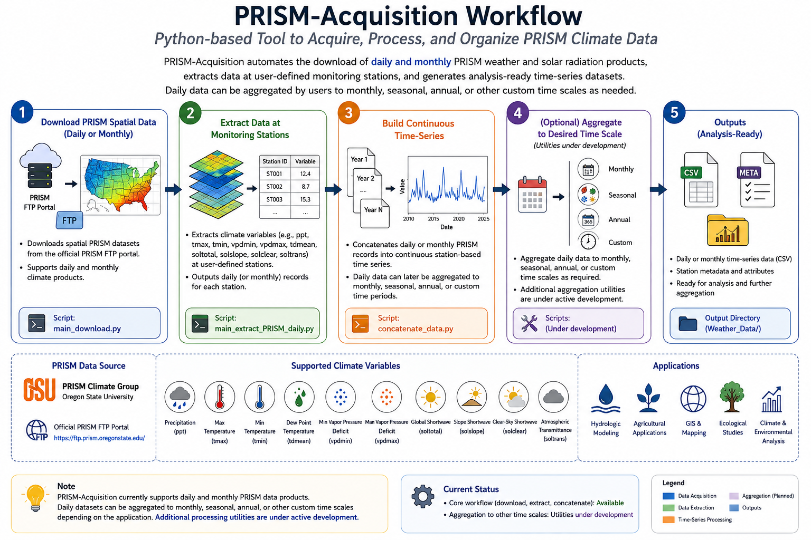

# Python-based Tool to Acquire [PRISM Climate data](https://prism.oregonstate.edu)

**PRISM-Acquisition** is an open-source Python package that automates the acquisition, extraction, processing, and organization of PRISM climate datasets. The package provides command-line interface (CLI) tools and modular Python functions for downloading daily and monthly PRISM weather and solar radiation products, extracting climate variables at user-defined monitoring stations, and generating analysis-ready time-series datasets. Daily datasets can be readily aggregated to monthly, seasonal, annual, or other user-defined temporal scales, while additional processing utilities are under active development. PRISM-Acquisition is intended for hydrologic, agricultural, environmental, ecological, and geospatial applications requiring efficient access to long-term, high-resolution climate data.

## Workflow



## *PRISM Climate Data*
**PRISM climate datasets are maintained by the PRISM Climate Group at Oregon State University. PRISM (Parameter-elevation Regressions on Independent Slopes Model) provides high-resolution daily and monthly weather and solar radiation datasets. This package downloads and processes these datasets from the official PRISM FTP portal.**

For daily and monthly datasets, the supported variables include **Precipitation, Minimum Temperature, Maximum Temperature, Mean Dew Point Temperature, Minimum Vapor Pressure Deficit, Maximum Vapor Pressure Deficit, Total Shortwave Solar Radiation, Slope Shortwave Solar Radiation, Clear-Sky Shortwave Solar Radiation, and Atmospheric Transmittance. Spatial datasets are downloaded from the official PRISM FTP portal, which provides daily and monthly gridded climate products.**

# Python Dependencies
* os
* pathlib
* pandas
* zipfile
* geopandas
* rasterio
* osgeo - gdal, osr, ogr
* Fortran format
  
# Primary Steps
## Step 1: Download the spatial data 
Spatial data in bill format can be downloaded in daily or monthly scale as follows:

`python main_download.py --dir2Save='path/to/save_spatial_data' --start_year=START_YEAR --end_year=END_YEAR --scale=SCALE --attribute=VARIABLE`

This script allows the user to download spatial climate data stored on the **PRISM FTP portal** at daily or monthly scales. For this, the user needs to specify:

`dir2Save`: Path to save the download PRISM spatial data saved under the [FTP portal](https://ftp.prism.oregonstate.edu) (string)

`start_year`: Beginning of the year to download the data (integer)

`end_year`: End of the year to download the data  (integer)

`scale`: Temporal scale, monthly or daily  (string)

`attribute`: PRISM weather or solar radiation variable to process (string). Supported values include `ppt` for daily total precipitation, `tmax` for daily maximum temperature, `tmin` for daily minimum temperature, `tdmean` for daily mean dew point temperature, `vpdmin` for daily minimum vapor pressure deficit, `vpdmax` for daily maximum vapor pressure deficit, `soltotal` for daily global shortwave solar radiation on a horizontal surface, `solslope` for daily global shortwave solar radiation on a sloped surface, `solclear` for daily global shortwave solar radiation on a horizontal surface under clear-sky conditions, and `soltrans` for atmospheric transmittance (cloudiness).

 ## Step 2: Extract daily PRISM data
 
  `python main_extract_PRISM_daily.py --root_dir='path/to/downloaded_prism_data' --start_year=YEAR --end_year=YEAR --attribute=VARIABLE --station_file='STATION LIST FILE --output_dir=path/to/data_dir --scale=SCALE`
  
  Prior to this, the user needs to prepare a list of stations in a `csv` file that includes the following order:
  
  * `Station,`
  * `Name,`
  * `Longitude,`
  *  `Latitude,`
  *  `Elevation(m) [optional],`
  *  `Network [optional],` and
  *  `stnid [optional],`

 ## Step 3: Extract daily time series of weather variable PRISM data
 
`python concatenate_data.py --start-year START_YEAR --end-year END_YEAR --attribute VARIABLE --state-name None --data-dir 'path/to/downloaded_prism_data`

 Concatenates annual PRISM weather records for a selected variable into a continuous daily time-series dataset and exports the associated station metadata and attribute data. For this, the user needs to specify:

`start_year`: Beginning of the year to download the data (integer)

`end_year`: End of the year to download the data  (integer)

`attribute`: PRISM weather or solar radiation variable to process (string). Supported values include `ppt` for daily total precipitation, `tmax` for daily maximum temperature, `tmin` for daily minimum temperature, `tdmean` for daily mean dew point temperature, `vpdmin` for daily minimum vapor pressure deficit, `vpdmax` for daily maximum vapor pressure deficit, `soltotal` for daily global shortwave solar radiation on a horizontal surface, `solslope` for daily global shortwave solar radiation on a sloped surface, `solclear` for daily global shortwave solar radiation on a horizontal surface under clear-sky conditions, and `soltrans` for atmospheric transmittance (cloudiness).

`state-name`: Name of the U.S. state used to process and organize PRISM weather data (`string`). If `None`, data for all available stations are concatenated and saved in the Weather_Data directory without a state-specific station information file name; otherwise, outputs are generated for the specified state, and the station metadata file is named accordingly.

 `data-dir`: Path to spatial data saved in **Step 2**

## PRISM Documentation

Descriptions of all supported PRISM weather and solar radiation variables are based on the official PRISM Climate Group dataset documentation.

For additional information, see:
- **PRISM Datasets Documentation (Oregon State University): [https://ftp.prism.oregonstate.edu/PRISM_datasets.pdf]**

## Citation

If this software is used in research, publications, reports, or other scholarly work, please cite this repository. Citation helps acknowledge the contribution of this project and supports its continued development.

**Suggested citation:**

```text
Maskey, M. L. (2026). PRISM-Acquisition: A Python-Based Tool to Acquire and Process PRISM Climate Data. GitHub Repository. https://github.com/mlmaskey/PRSIM-Acquisition
```

In addition, users should cite the official PRISM Climate Group datasets, where appropriate. Detailed information on the supported weather and solar radiation variables is available in the official **[PRISM documentation](https://ftp.prism.oregonstate.edu/PRISM_datasets.pdf)**.
  


